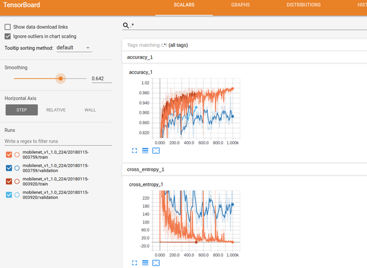

# Transfer Learning 101

## How do I get set up? ###

1. Make sure you either: 
    * create a virtual environment 
    * or are running a docker container with docker ([see here](https//hub.docker.com/r/tensorflow/tensorflow/))
2. Install the dependencies with the `requirements.txt` in this repo.

Both Python 2.7 and Python 3.5 should work (tested with 2.7 and 3.5). That said, it's time to let 2.7 go.

Quick start with a virtual environment:
```sh
$ virtualenv -p $(which python3) py-tf
$ source py-tf/bin/activate
$ pip install -r requirements.txt
```


## Finding your way ###
`sh` is your entry point; there's a bash script to showcase the usage of the retraining code

`scripts` contains the retraining code; notice there have been some modifications to the original Tensorflow github script, 
but the interface is the same.

`tf_files` contains data, models and tensorboard logs (training_summaries), just
 like in the original Tensorflow Transfer Learning [tutorial](https://www.tensorflow.org/tutorials/image_retraining). However, you will be able to see
 stacked plots on the Tensorboard.


## Tensorboard ####
Notice tf_files/training_summaries contains the following structure:
   * architecture
      * training_timestamp
        * train
        * validation

This way you will be able to compare the loss function and other metrics from different trainings in the same Tensoboard
plot.



Once you've already launched a training, go to a second terminal and
start your Tensorboard with:

```sh
tensorboard --logdir=tf_files/training_summaries &
```

Go with your browser to http://localhost:6006 and enjoy!


## Plan for the workshop

Check the wiki!

Recap:

We'll be switching back and forth from command line (to launch trainings) to
Tensorboard, to see what's going on.

* Tweak parameters inside sh/retrain.sh and launch with
```
sh/retrain.sh
```
* Launch Tensoboard only once with 
```tensorboard --logdir=tf_files/training_summaries```


## License ###
Modifications are under the same Apache license as the original Tensorflow code.
